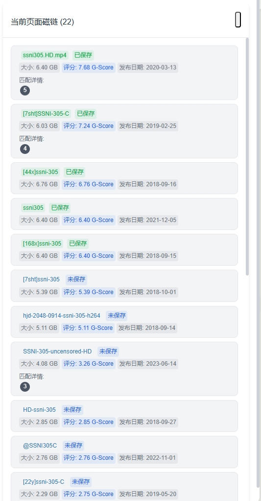
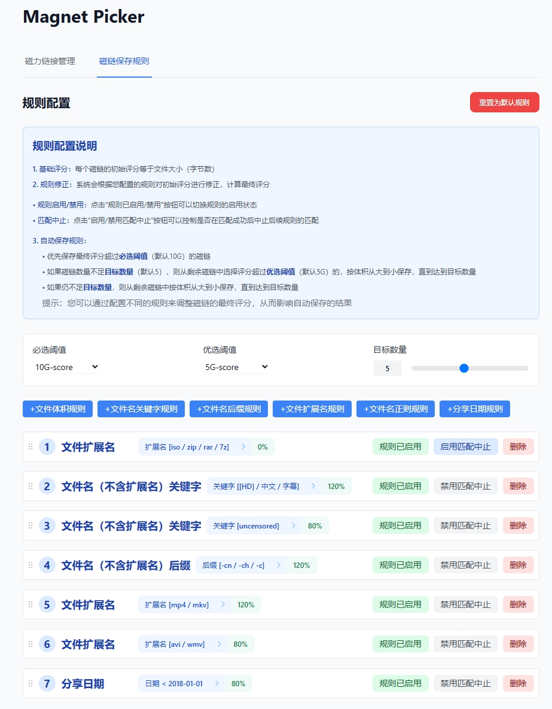
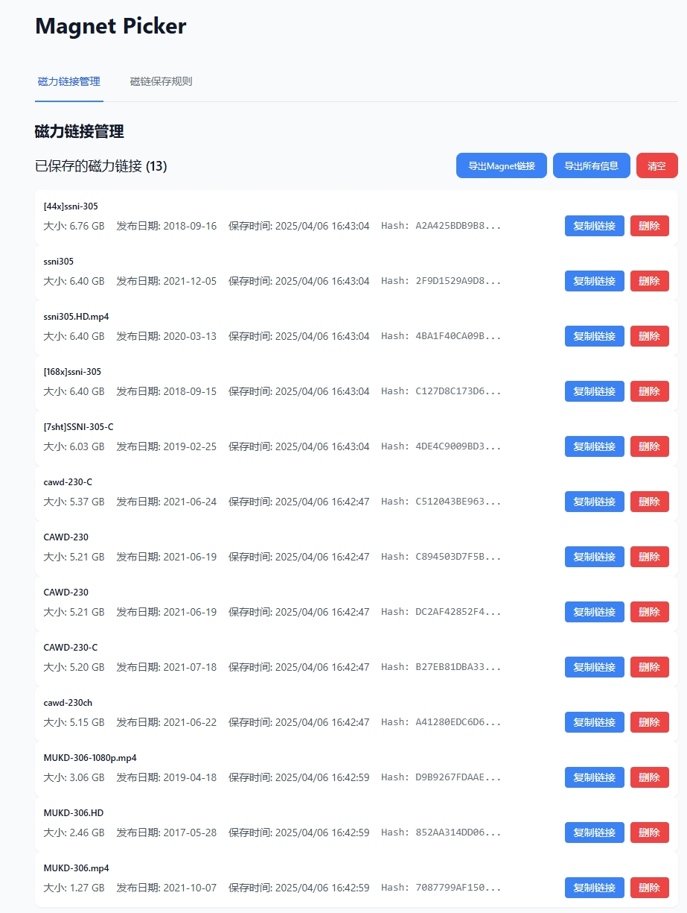

# Magnet Picker - 磁链选择助手

## 功能介绍

### 核心功能：
- 把页面上的magnet链接解析出来
- 按照配置的规则，自动选取优质的，保存到浏览器本地存储
- 后续可以一键导出（以便大批量贴入bittorrent或者115）
- 当前仅支持javbus（个人玩具，啥时候有空再更新其它车牌站的支持）

### 界面展示

#### 1. 磁链弹层
<div style="text-align: center">
  <a href="./docs/images/magnet-panel.png" target="_blank">
    
  </a>
</div>

#### 2. 规则配置
<div style="text-align: center">
  <a href="./docs/images/rule-config.png" target="_blank">
    
  </a>
</div>

#### 3. 磁链管理
<div style="text-align: center">
  <a href="./docs/images/magnet-manage.png" target="_blank">
    
  </a>
</div>

## 安装指南

### 方法一：从源代码安装

1. 克隆项目到本地
   - 打开命令行工具（Windows用户请使用PowerShell或CMD）
   - 进入您想要存放项目的目录
   - 运行以下命令：
     ```bash
     git clone https://github.com/watchzerg/magnet-picker.git
     cd magnet-picker
     ```

2. 安装依赖并构建
   - 确保您已经安装了Node.js（建议使用最新LTS版本）
   - 在项目目录下运行以下命令：
     ```bash
     npm install
     npm run build
     ```

3. 在Chrome中加载扩展
   - 打开Chrome浏览器
   - 在地址栏输入 `chrome://extensions/`
   - 打开右上角的"开发者模式"开关
   - 点击"加载已解压的扩展程序"
   - 选择项目目录下的 `dist` 文件夹

### 方法二：直接安装（适合普通用户）

1. 下载扩展文件
   - 从[发布页面](https://github.com/watchzerg/magnet-picker/releases)下载最新的 `.crx` 文件
   - 将文件保存到您的电脑上

2. 安装扩展（两种方式任选其一）：

   **方式一：直接安装**
   - 打开Chrome浏览器
   - 在地址栏输入 `chrome://extensions/`
   - 打开右上角的"开发者模式"开关
   - 将下载的 `.crx` 文件拖拽到扩展页面中
   - 点击"添加扩展程序"确认安装

   **方式二：解压后安装（如果方式一失败）**
   - 将 `.crx` 文件重命名为 `.zip` 文件
   - 使用解压工具（如WinRAR、7-Zip等）解压该文件到一个新文件夹
   - 打开Chrome浏览器
   - 在地址栏输入 `chrome://extensions/`
   - 打开右上角的"开发者模式"开关
   - 点击"加载已解压的扩展程序"
   - 选择解压后的文件夹

## 使用说明

1. 安装完成后，您会在Chrome浏览器右上角看到扩展图标
2. 访问支持磁力链接的网站（如：https://www.javbus.com/[番号]）
3. 在番号详情页面，右侧会出现悬浮按钮
4. 点击悬浮按钮即可看到解析好的磁链弹层（并且已经按配置进行了挑选保存）
5. 浏览结束之后，统一去插件配置页面选择批量导出。